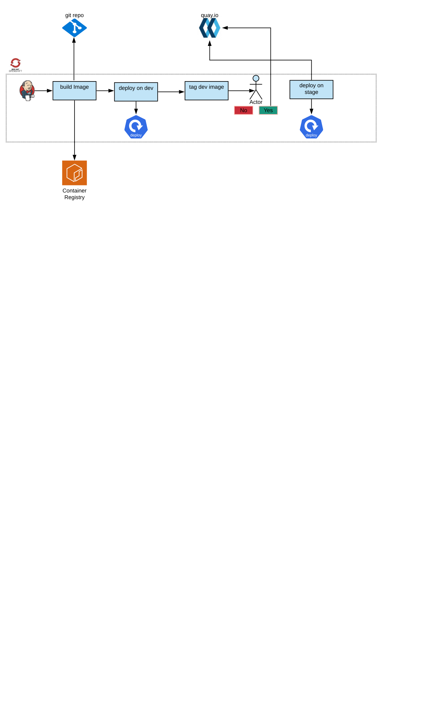

# CI/CD Demo for Python flask application- OpenShift Container Platform 4

This repository contains a simply python flask application, and code to setup an Openshift pipeline for it. 
* [Introduction](#introduction)
* [Prerequisites](#prerequisites)
* [Automated Deploy on OpenShift](#automatic-deploy-on-openshift)
* [Delete Pipeline](#delete-pipeline)


## Introduction
The Openshfit Projects related to the application and different evioronments (cicd, dev, stage) are setup by executing the shell script. The script also creates the resources for applications, Jenkins server and application pipeline. The pipeline execution create the image using s2i process, and then push it to the quay.io registry. On an input from the user, it is then deployed to the stage project
## Prerequisites
The user running the bootstrap script must be logged on to the OCP cluster, and have the permissions to create projects in the OCP cluster. The application source code repository and Jenkinsfile in the parent folder of the repository are required as in the current project.

## Automated Deploy on OpenShift
The Openshift projects, and resources are created by running the script `openshift/cicd-setup.sh`, provided in the openshift directory. The script requires certain command line parameters.
To deply the pipeline run:
```
./cicd-setup.sh deploy --project-suffix my-demo --app-name simpleflask --quay-username <quay-user>\
                       --quay-password <quay-password> --quay-repo <quay-repo> \ 
                       --repo-url <git_url> --repo-reference master
```
* The above script create projects:

      

* The openshift application resources:


* The application pipeline in the cicd-<app-name> project:


## Delete Pipeline
The delete functionality of the pipeline and application projects is provided by executing:
```
./cicd-setup.sh delete --project-suffix <project-suffix>
```
